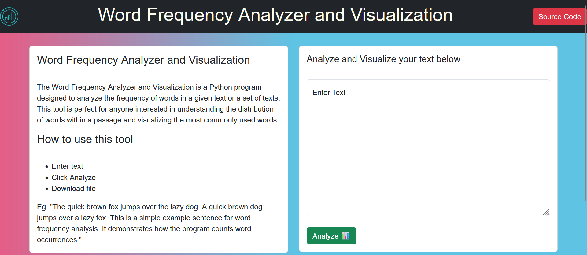

# Word Frequency Analyzer and Visualization 📊
### Video demo: [click here](https://youtu.be/i3V3fnvyWwE)

Welcome to the Word Frequency Analyzer and Visualization project repository! This Python Flask-based web application is designed to analyze word frequency in a given text and visually represent the most common words. This README provides a comprehensive guide to understand, set up, and utilize this project effectively. The Word Frequency Analyzer and Visualization is a Python program designed to analyze the frequency of words in a given text or a set of texts. This tool is perfect for anyone interested in understanding the distribution of words within a passage and visualizing the most commonly used words.

## Table of Contents

1. [Overview](#overview)
2. [Project Structure](#project-structure)
3. [Usage](#usage)
    - [Running the Application](#running-the-application)
    - [Screenshots](#screenshots)
4. [Technologies Used](#technologies-used)
5. [Contributing](#contributing)

---

## Overview

The Word Frequency Analyzer and Visualization project is an interactive web application developed using Python, Flask, Jinja, HTML, CSS, Bootstrap, SQLite3, Matplotlib, and NLTK. It allows users to input text, analyze word frequency, and visualize the most common words through a user-friendly interface.

## Project Structure

### Directories:

- **static**: Contains static files, including:
  - `styles.css`: CSS styles for the project.
  - `barchart.png`: The saved file from the main Python app.
  - Logo icon.

- **templates**: Contains HTML files:
  - `index.html`: Homepage for text input.
  - `analyzed.html`: Display page after Python processing.
  - `error.html`: Error page for handling analysis issues.

### Files:

- `word_frequency.py`: Contains the `WordFrequency` class for text analysis and visualization.
- `app.py`: (Flask) Main application script for routing, data manipulation, and uses WordFrequency class to analyze and visualize data.
- `test_WordFrequency.py`: Python testing for the WordFrequency.py
- `frequency.db`: Database which contains two tables `text` - stores input text of users and `visits` - stores button click and download counts.

## Usage

### Running the Application

1. **Setup**:
   - Ensure necessary dependencies are installed (`nltk`, `matplotlib`, `cs50`, `pytest`).
   - Run `pip install nltk matplotlib cs50 pytest` to install missing libraries.
   - Run `python -m nltk.downloader stopwords punkt`
   - Run `pytest test_WordFrequency.py` to test WordFrequency class from the module.

2. **Start the Flask App**:
   - Run `flask run` in your terminal.
   - Access the application at `http://localhost:5000/`.

3. **Usage**:
   - Enter text in the provided field on the homepage.
   - Click the "Analyze" button to process the text and view word frequencies.
   - Click "Download" to download the PNG file of your word analysis

### Screenshots

## Technologies Used

- Python
- Flask
- Jinja
- HTML
- CSS
- Bootstrap
- SQLite3
- Matplotlib
- NLTK
- Pytest
- CS50 

## Contributing

Contributions are welcome! Feel free to submit issues or pull requests to enhance the project.

## Ryan Tusi - Chennai, India
